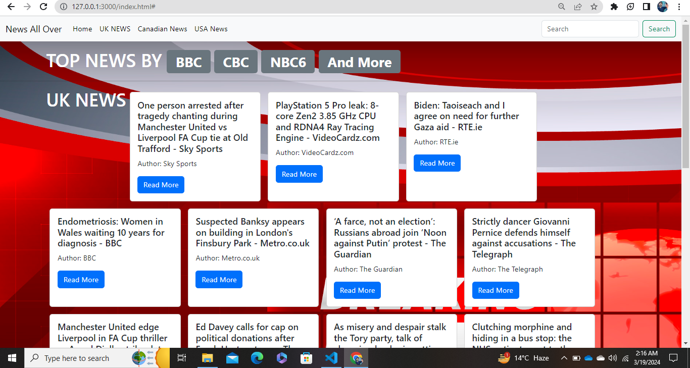
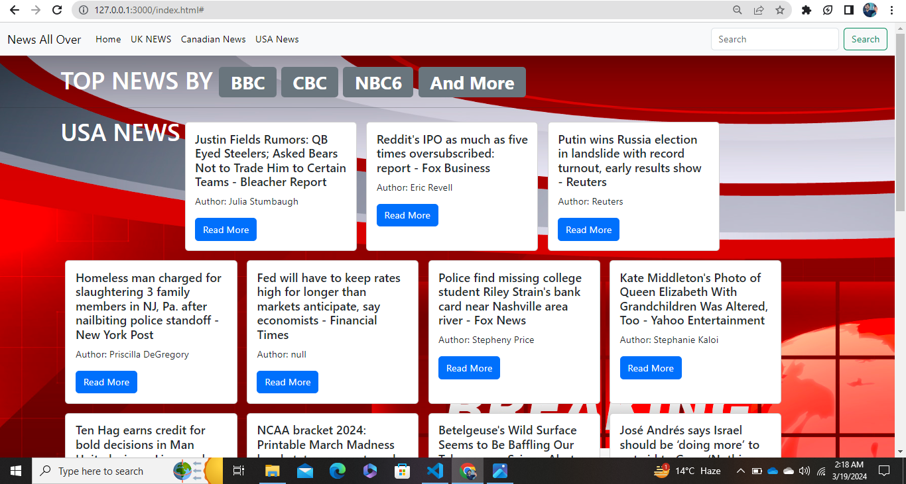
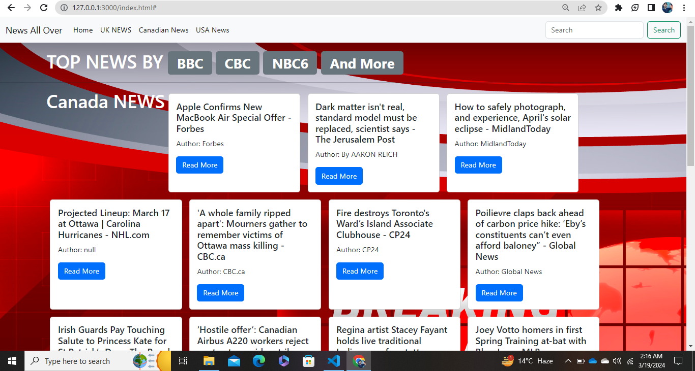

# NewsHubUKUSCA!

NewsHubUKUSCA is a JavaScript-based news aggregator that provides real-time updates from the United Kingdom, United States, and Canada. Powered by an API, this project delivers the latest news articles with a clean and intuitive user interface, offering users a seamless browsing experience. Stay informed about current events across the Atlantic with this user-friendly news platform.

## Features!

- Utilizes JavaScript for dynamic content rendering and interactivity.
- Fetches news data from an API for up-to-date information.
- Presents news articles from the UK, USA, and Canada in a visually appealing manner.
- Responsive design ensures compatibility across various devices and screen sizes.
- Offers a seamless user experience with intuitive navigation and fast loading times.

## Installation

To get started with NewsFlashJS, follow these steps:

1. Clone the repository:
   ```bash
   git clone https://github.com/yourusername/NewsFlashJS.git
## Usage

Once you have the project running, you can:

- View the latest news articles from the UK, USA, and Canada.
- Click on each article to read more details.

## Screenshots

### United Kingdom (UK) News Section
<!-- Add screenshot for UK news section -->


### United States (USA) News Section
<!-- Add screenshot for USA news section -->


### Canada (CA) News Section
<!-- Add screenshot for Canada news section -->


## Contributions

Contributions are welcome! Whether it's enhancing existing features, optimizing performance, or adding new functionalities, your contributions play a vital role in improving NewsFlashJS for users worldwide. Fork the repository, make your enhancements, and submit pull requests to contribute to the project's growth.
